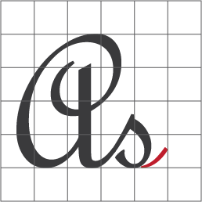

# Website html User Interface.

# Documents.

Cybotranik [documentation](https://cybotranik-wui.github.io/) and examples are available at. 

See how it works for a [quick start](docs/how-do-i-start.md).

# Community

[Discuss](https://cybotranik-wui.slack.com/) new features, future goals, general problems or questions about Cybotranik's development, or anything else you can think of.

# Contribute

Please read these guidelines before contributing to Cybotranik:

- Before you begin, [Contribute](CONTRIBUTING.md)
- Before you begin, [Code of Conduct](CODE_OF_CONDUCT.md)
- Before you begin, [See the pull requests.](../../pulls)

# Bugs and feature requests

Have a bug or a feature request? Please first read the issue guidelines and search for existing and closed issues. If your problem or idea is not addressed yet, please open a new issue.

# Copyright and license

Codes and documents copyright 2019 Cybotranik. Code published under MIT License. Documents published under Creative Commons.
